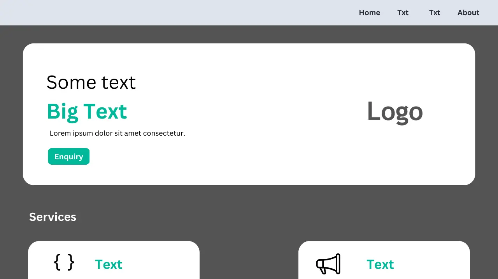

<h1>Portfolio Website</h1>

This is my personal portfolio website showcasing my skills, projects, and professional background. The website is designed to be a single-page application with smooth navigation and responsive design..

<h2>Features</h2>
<ul>
  <li align="justify"><b>Responsive Design:</b> Ensures the website looks great on all devices, from desktops to mobile phones.</li>
  <li align="justify"><b>Modern UI:</b> Utilizes Bootstrap for a sleek and clean design.</li>
  <li align="justify"><b>Navigation Bar:</b> Smooth scrolling and easy-to-use navigation for a seamless user experience.</li>
  <li align="justify"><b>About Section:</b> A concise section to introduce yourself and highlight your background.</li>
  <li align="justify"><b>Projects Showcase:</b> Beautifully designed layout to display your projects with images and descriptions.</li>
  <li align="justify"><b>Skills Section:</b> Clearly presented skills with progress bars or icons.</li>
  <li align="justify"><b>Contact Information:</b> Contact details with a functional contact form for easy communication.</li>
  <li align="justify"><b>Footer:</b> Contains social media links and additional information about you.</li>
</ul>

<h2>Technologies Used</h2>
<ul>
  <li align="justify"><b>HTML5:</b> For structuring the content on the web.</li>
  <li align="justify"><b>CSS3:</b> For styling and enhancing the appearance of the website.</li>
  <li align="justify"><b>Bootstrap 5:</b> For responsive layout and pre-designed components.</li>
</ul>
  
<h4 align="center">Portfolio Website Project | Created by <a href="https://askaf.in/" target="_blank">Askaf</a></h4>
